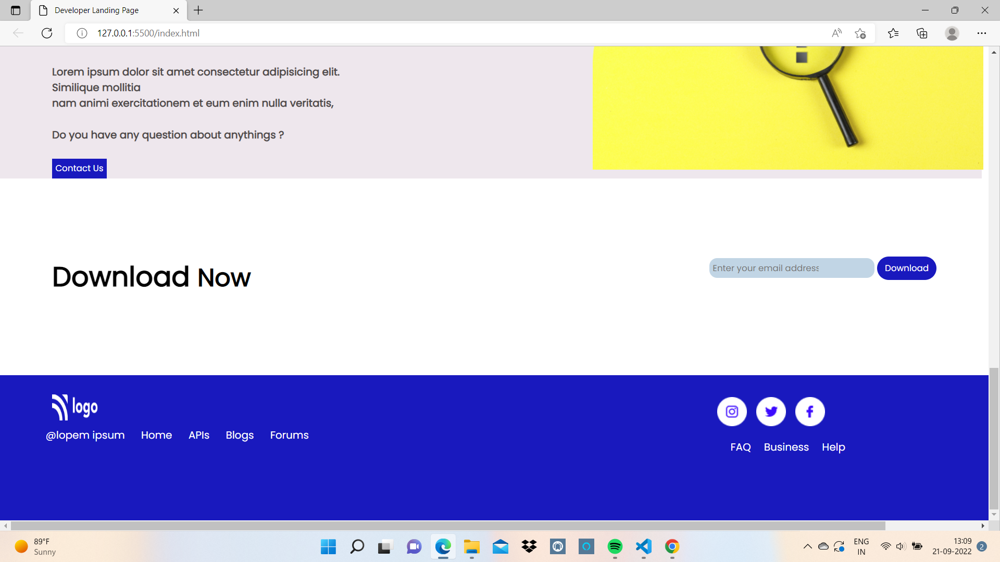

# Project Title : Developer Home Page

## About

This project was to build a Developer Home Page, adding few images , creating cards and making the page Mobile Responsive.

## What Did I Learn From This Project

After making previous projects I have got improved and I could write code better way.

## Time Taken To Finish The Project

Around 6 Hours.

## Screen Resolution

1920 * 1080

## Project Final Look

